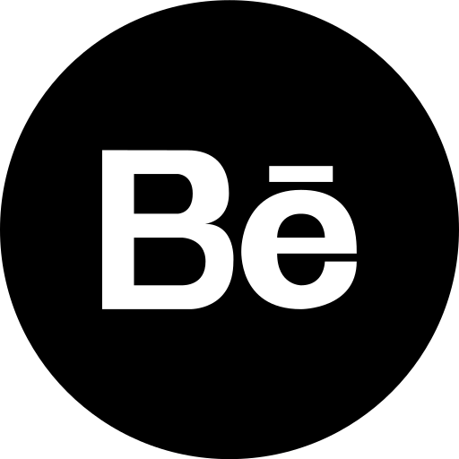
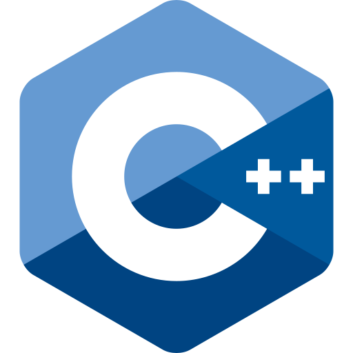
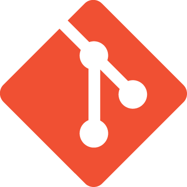

<h1 align="center">
 <a href="https://git.io/typing-svg">
    
  </a>
</h1>

<h5 align="center">
  <code></code>  
  <code></code>
  <code></code>
  <code></code>
</h5>
 

👑 Hola, This is Menna Elseyed 
👩🏻‍💻 Educational Content Creator 
💻 nodjs Backend Developer  
🎯 Competitive Programmer 
🎨 Graphic Designer 
  

   
   
  

🎓 I'm Menna Elsayed, a third-year student at Faculty of Computer and Information Science – Mansoura University.
   
💡 I'm interested in Coding and Backend Development, with a focus on practical application throughprojects.
   
🎬 I create educational content to simplify complex technical concepts and promote effective learning.
   
💻 I'm focusing on Node.js Framwork , Problem Solving with c++ for competitive programming.
   
🎨 Beyond code, I enjoy the art of design, creating beautiful and real Designs.
  

   
  

  📫 How to reach me: <a href="engmenna512@gmail.com">engmenna512@gmail.com</a> 

   
<h2 align="center">🔥 Tools & Technologies 🔥</h2>
 

 
  <code></code>
  <code></code>
<!--<code></code>-->

  <code></code>
  <code></code>
  <code></code>
  <code></code>
  <code></code>
  <code></code>

  <code></code>
  <code></code>
  <code></code>
 <code></code>

